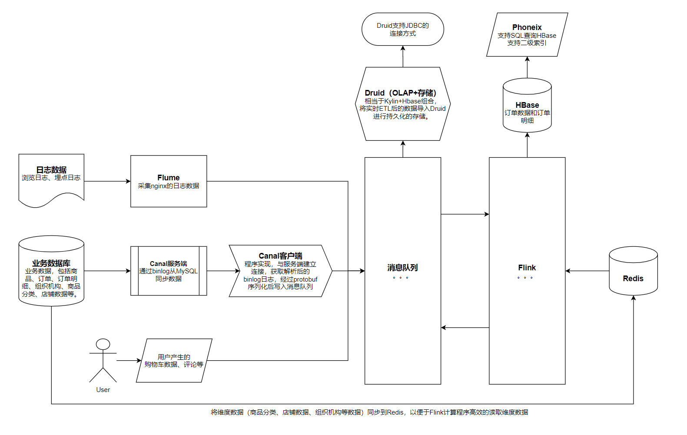

# Flink实时数据仓库


## 1. 实时计算机应用场景及技术选型


### 1.1 实时计算技术选型



## 2. Canal介绍


### 2.1 简介


```go
type Set map[string]struct{}

func NewSet(ele ...string) Set {
    s := Set{}
    s.Put(ele...)
    return s
}

func (s Set) Put(ele ...string) {
    for _, e := range ele {
        s[e] = struct{}{}
    }
}

func (s Set) Del(e string) {
    delete(s, e)
}

// 随机返回一个元素
func (s Set) Pop() string {
    var e string
    if len(s) > 0 {
        for k := range s {
            e = k
            break
        }
        delete(s, e)
    }
    
    return e
}

func (s Set) Len() int {
    return len(s)
}

func (s Set) Slice() []string {
    sl := make([]string, 0)
    for e := range s {
        sl = append(sl, e)
    }
    return sl
}
```

