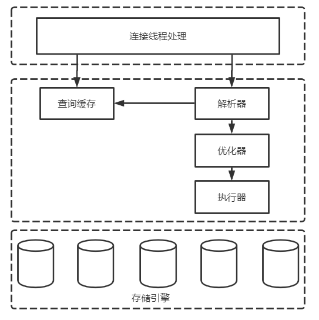

# MySQL基本原理

## 一、MySQL逻辑架构

MySQL整体逻辑架构可以分为连接层、服务层和存储引擎层，如下图。

### 1.1 连接层

`连接层`主要负责连接管理、授权认证以及安全等。

> 注，客户端如果长时间没有向服务端发送请求，连接器就会自动断开连接。这个超时时间由参数`wait_timeout`控制，默认值是`8`小时。因此，需要配置`validationQuery=SELECT 1`以及`validationQueryTime(s)`等参数来检查连接有效性。

#### 1.1.1 连接管理

#### 1.1.2 安全性

### 1.2 服务层

#### 1.2.1 查询缓存

#### 1.2.2 解析器

#### 1.2.3 优化器

#### 1.2.4 执行器

### 1.3 存储引擎层

### 1.4 查询过程

## 二、事务

### 2.1 事务特性（ACID）

### 2.2 事务隔离级别

### 2.3 隔离级别的实现

## 三、并发控制

### 3.1 锁

#### 3.1.1 锁分类

#### 3.1.2 锁算法

#### 3.1.3 死锁

### 3.2 多版本并发控制

### 3.3 InnoDB加锁分析

## 四、存储引擎

### 4.1 InnoDB

### 4.2 MyISAM

### 4.3 存储引擎比较

### 4.4 存储引擎选型

## 五、MySQL中的日志

### 5.1 错误日志

### 5.2 查询日志

### 5.3 慢查询日志

### 5.4 二进制日志（binlog）

### 5.5 重做日志（redo log）

### 5.6 回滚日志（undo log）

### 5.7 中继日志（relay log）

## 六、索引

### 6.1 索引类型

### 6.2 索引的优缺点

### 6.3 高性能索引策略

### 6.4 索引优化

## 七、查询性能优化

### 7.1 查询执行过程

### 7.2 多表关联查询

### 7.3 查询性能优化策略

#### 7.3.1 精简访问数据

#### 7.3.2 查询方式

#### 7.3.3 优化特定类型查询

## 八、MySQL多机部署

### 8.1 主从复制

### 8.2 高可用部署方案

## 参考

